# Abdulganiyu Babatunde Adegbindin's Portfolio 

Hello,
I am Abdulganiyu Babatunde Adegbindin, a passionate and detail-oriented Business Analyst with a strong foundation in data analysis, visualization, and reporting. I specialize in turning raw data into clear, actionable insights that drive strategic decision-making. With experience in tools like Microsoft Excel, Power BI, and SQL, I enjoy solving business problems through data storytelling and interactive dashboards. My approach combines analytical thinking with a focus on business value.

Welcome to my portfolio! 
Here you will find a collection of projects showcasing my skills in:

Dashboard Creation (Excel & Power BI)
Data Cleaning & Transformation
Data Integration using functions like VLOOKUP and XLOOKUP
Insights & Reporting through pivot tables, charts, and KPIs
Business Insights & Recommendations

These projects showcases expertise in data visualization, business intelligence, and analytical storytelling, transforming raw data into actionable insights for strategic planning. Each project reflects real-world business scenarios—from sales tracking to customer segmentation—demonstrating how I translate data into insight.

# Project 1

**Title** : [Nike Retail Partners Dashboard 2022](https://github.com/AdeBabs1/dataanalytics)

**Description** : This shows an overview of sales from NIKE Retail partners in 2022.

This project provides a comprehensive overview of NIKE's retail partner sales performance in 2022. 

Using Excel for data cleaning, transformation, initial analysis, and dynamic visualizations and insights, this project highlights key sales trends, revenue distribution, and partner performance. 
The dashboard includes metrics such as total sales, regional performance breakdowns, top-performing products, and seasonal trends, offering valuable business intelligence for decision-making.

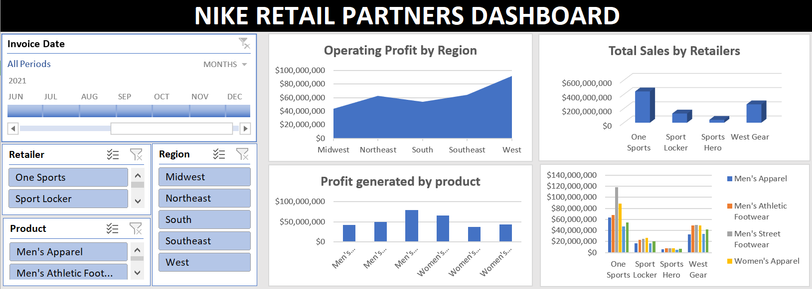

# Project 2

**Title** : [Retail Sales Dashboard for 2019/2020](https://github.com/AdeBabs1/dataanalytics)

**Description** : This is a summary of the retail sales for 2019/2020. 

This project provides a comprehensive summary of retail sales for 2019/2020, leveraging Excel for data cleaning, analysis, and visualization. 

The dataset was processed using advanced Excel functions, including pivot tables, VLOOKUP, IF statements, and dynamic charts, to uncover key sales trends, seasonal patterns, and revenue fluctuations. The analysis highlights year-over-year performance, identifying top-performing products, sales distribution across regions, and customer purchasing behaviors. 
By transforming raw sales data into actionable insights, this project demonstrates strong data storytelling, trend analysis, and business intelligence skills essential for decision-making.

# Project 3

**Title** : [Workplace safety power BI Dashboard 2022](https://github.com/AdeBabs1/dataanalytics)

**Description** : This shows a Power BI overview of workplace safety in 2022. 

This Power BI project provides a comprehensive overview of workplace safety in 2022, transforming raw safety data into actionable insights through dynamic visualizations and interactive dashboards. 

Using Power BI's data modeling, DAX calculations, and custom visualizations, this analysis highlights key safety metrics, including incident rates, injury trends, compliance levels, and high-risk areas across different departments. The dashboard enables stakeholders to identify patterns, track safety improvements, and make data-driven decisions to enhance workplace safety protocols.

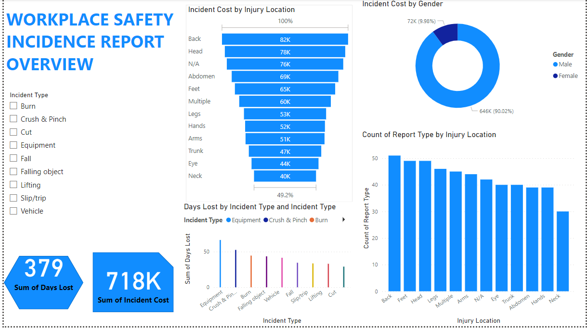

# Project 4

**Title** : [INSURANCE POLICY POWER BI DASHBOARD](https://github.com/AdeBabs1/dataanalytics)

**Description** : This shows a Power BI overview of Insurance Policies in 2022 leveraging interactive dashboards and dynamic visualizations to provide key insights.

Using Power BI's data modeling, it highlights policy distribution, claim trends, and premium collections. The dashboard offers insights into customer demographics, risk assessment patterns, and claims processing efficiency, enabling stakeholders to identify opportunities for optimizing policy management and enhancing customer satisfaction.

# Project 5

**Title** : [PREMIUMTECH SALEs PERFORMANCE DASHBOARD](https://github.com/AdeBabs1/dataanalytics)

**Description** : This project features a sales dashboard created for PremiumTech Stores using Microsoft Excel. It leverages Pivot Tables, Charts, and VLOOKUP to clean, merge, and analyze multiple datasets.

Using excel, raw data were cleaned and prepared for analysis
merging datasets using VLOOKUP for a unified view
and Pivot Tables were used to summarize key metrics (sales, products, regions)
to create dynamic charts to visualize trends and performance for 2022/2023
which led to buidling an interactive, user-friendly dashboard layout

Excel tools like Pivot Tables, Charts, VLOOKUP and Slicers were used to produce
this dashboard to support data-driven decisions by presenting insights into sales performance, product trends, and customer behavior.

# Project 6

**Title** : [SUNSET HOSPITALITY PERFORMANCE DASHBOARD](https://github.com/AdeBabs1/dataanalytics)

**Description** : This project provides insights into the Sunset Hospitality performance for a selected period.

It provides a comprehensive view of key booking and guest behavior metrics to support strategic decision-making. 

Built in Excel, it simplifies complex data into actionable insights by focusing on critical questions. It highlights trends in cancellation rates by hotel type, occupancy patterns across seasons, and booking behaviors segmented by country. 
It also identifies top-performing market segments and channels, pinpoints the busiest and slowest periods of the year, and uncovers differences between repeat and new guests. 
With a clear and interactive layout, this dashboard empowers Sunset Hospitality to optimize operations, improve guest loyalty, and drive revenue growth.

# Project 7

**Title** : [D HOSPITAL DASHBOARD](https://github.com/AdeBabs1/dataanalytics)

**Description** : D Hospital performance.

This Hospital Transaction Dashboard provides a comprehensive visual representation of key financial and operational metrics for a healthcare facility. 

Data Sourced from Structured hospital transaction data, from the electronic health records (EHR).

It is designed to aid decision-makers—such as hospital administrators, financial analysts, and healthcare managers—in monitoring revenue, expenses, profitability, 

and service utilization across various specialties and procedures.

The dashboard was developed to aggregate, visualize, and analyze hospital transaction data. KPIs for high-level overview:

Detailed visual analytics, including: Revenue trends by year and quarter, Revenue distribution by specialty and category, Revenue, expenses, and margin breakdown by procedure, 

and Filters for doctor and patient gender, state, and year

Microsoft Power BI and Excel tools were used for initial ETL Processes (Extract, Transform, Load):

DAX functions for metric calculations like profit margins, revenue totals, and transaction counts.

Data Visualization tools like KPI cards, charts, and tables for presentation and creating graphs and charts for time trends, specialties, and procedure details.

Slicers and filters for interactivity with the data by gender, state, and year and for dashboard Interactivity.

The Dashboard as a whole Investigates and advised based on insights

Declining Revenue: The sharp drop in 2023 Q2 and Q3 should be urgently analyzed. Possible causes include reduced patient intake, lower procedure volume, or billing inefficiencies.

Resource Optimization: With almost one doctor per patient, re-evaluate staff deployment or explore patient acquisition strategies.

Focus on High-Yield Specialties and Procedures: Invest more in marketing or resources for Dermatology and high-margin procedures like Skin Biopsy and Knee Replacement.

Geographic and Gender Filtering: Leverage state-level and demographic insights (California vs. New York, male vs. female) to tailor services and outreach.

It successfully highlights areas of strength, such as overall profitability and high-performing specialties, while identifying risks like declining revenue and potential inefficiencies in doctor-to-patient allocation. 

# Project 8

**Title** : [INSTACART PERFORMANCE DASHBOARD](https://github.com/AdeBabs1/dataanalytics)

**Description** : INSTACART (An E-Commerce) performance visualisation

I had used SQL in the past but this recent project reminded me of the power it has when compared to Excel and especially when complemented by a powerful visualisation tool like PBI.

First was the creation of the database in the Postgre SQL, then restoring my database, which led to seeing the Tables and fields in the database.

Using the query tool to bring me back to the last state or current state as at the last work on my SQL database and the use of the following query Syntax:
SELECT FROM;
ORDER BY;
WHERE
LIMIT;
INNER AND FULL JOINS;

I then used Power BI for ETL
1. Extract with Power Query
Using the Get Data feature, I connected to the SQL Database on PostgreSQL
This step is typically no-code and the connection is created between PBI and SQL and saved as part of the Power BI report.

2. Transform with Power Query Editor
After connecting to my data source (SQL database), Power BI automatically launches the Power Query Editor, this is where I was able to do major transformations like:
Remove duplicates and empty roles and null;
Filter rows;
Merged columns;
Changed data types; and
Created new and required calculated columns.
Each transformation step is recorded as a step in the “Applied Steps” pane, helping an iterative process if needed or as required.

3. Load into Power BI Model
Once the data is shaped and cleaned, I Closed & Applied it into Power BI’s in-memory data model. 
From here, I was able to:
Define relationships between tables using the ERD
Create measures and calculated columns using DAX (Data Analysis Expressions), and
Begin to build dashboards and reports on top of the structured data

I presented the insights and solutions to stakeholders for the project.

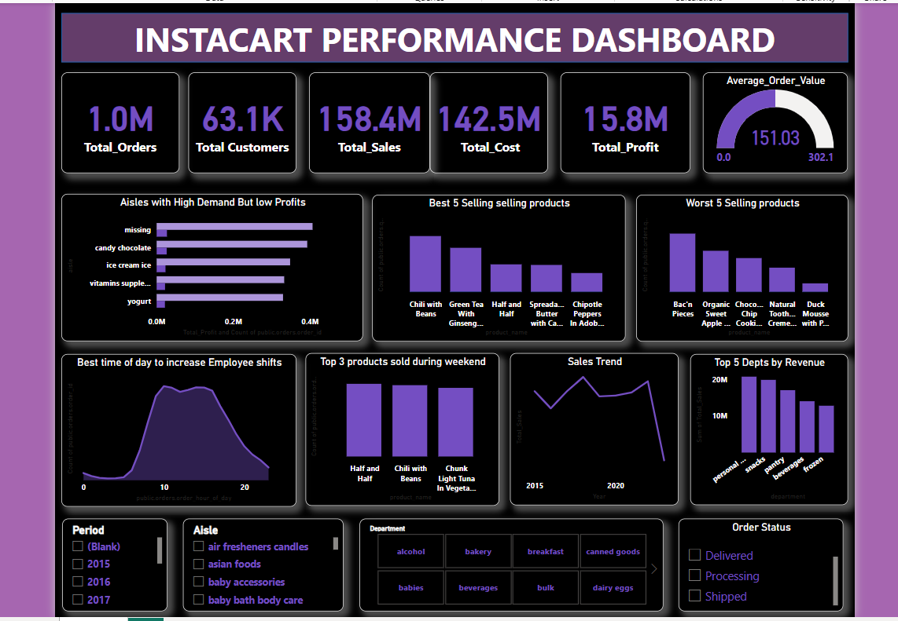

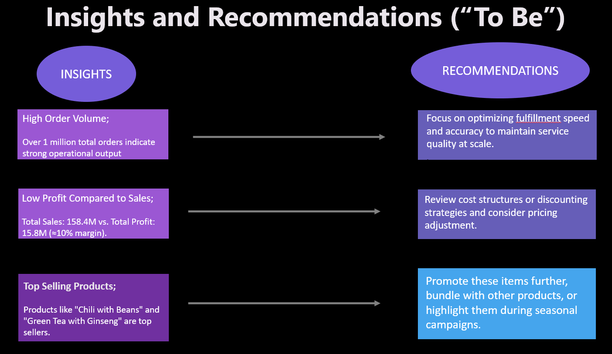

# Project 9

**Title** : THE BACCM CONCEPT FOR A HEALTHCARE TRANSFORMATION PROJECT

**Description** [ZENITH MEDICAL ANALYSIS USING THE BACCM CONCEPT](https://github.com/AdeBabs1/dataanalytics)

Stakeholder Analysis and Engagement Strategy for Healthcare Transformation Project

Objective:
To apply structured business analysis methods, including the BACCM framework, to identify key issues in a medical centre and design a clear stakeholder engagement and responsibility structure to support proposed solutions.

Key Activities: 
The BACCM concept was analysed for understanding and then needs identification through GAP analysis was carried and results presented. Using key tools and techniques like, interviewing, Survey, and observation for requirements gathering.
The power vs interest grid, RACI matrix, for stakeholder analysis and Identification:
All internal and external stakeholders (clinical, administrative, technical, regulatory, and patients) were mapped using the BACCM model to understand their needs, value impact, and relationships with proposed changes. Then, a Stakeholder Power vs Interest Grid was designed to prioritise engagement and communication strategies. High-power, high-interest stakeholders like the CMD, CFO, and Head of IT were identified for active management and consultation.
A RACI Matrix was created to produce a detailed matrix assigning roles to identify those that are Responsible, Accountable, to be Consulted, and Informed, for each project task, including defining scope, requirements gathering, software introduction, and data integration. This helped clarify roles across cross-functional teams and minimized overlap or gaps in responsibility.

As a result, recommendations for a revamp of the Current patient appointment system which relies heavily on manual processes and phone calls, that makes the team struggle with increased demand, were provided including an enabled and structured stakeholder engagement and clear role alignment, which will set the stage for smoother implementation of healthcare process improvements and digital transformation initiatives. 

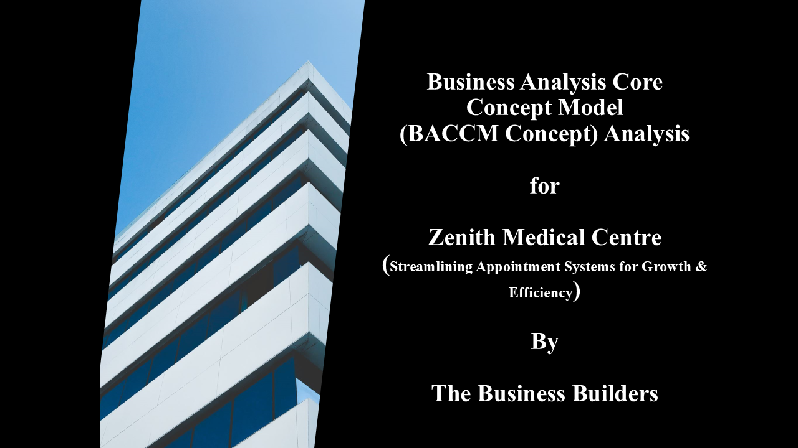

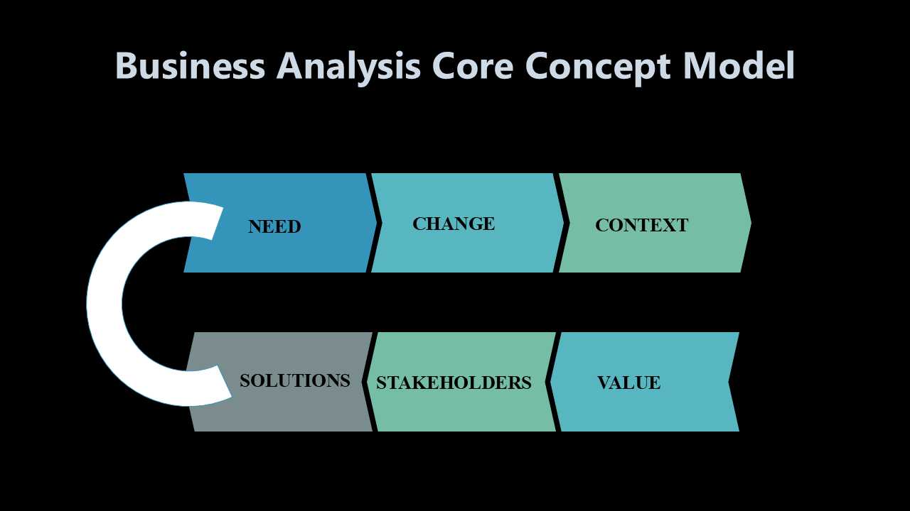

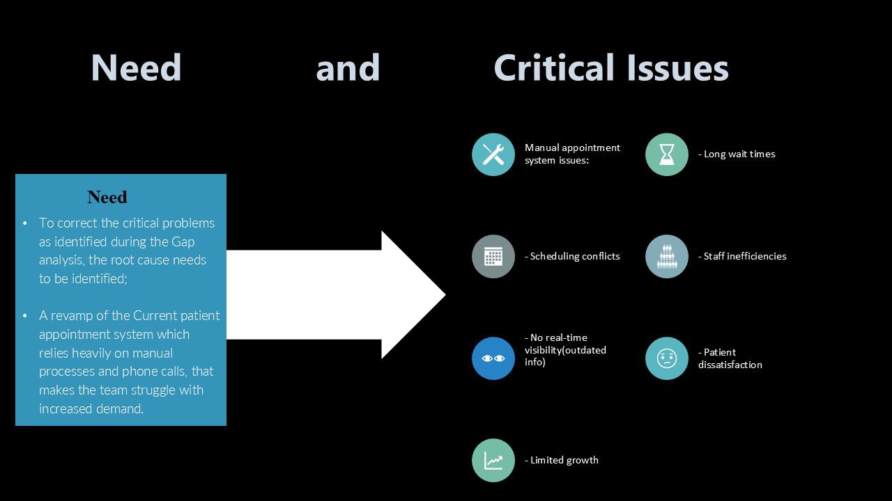

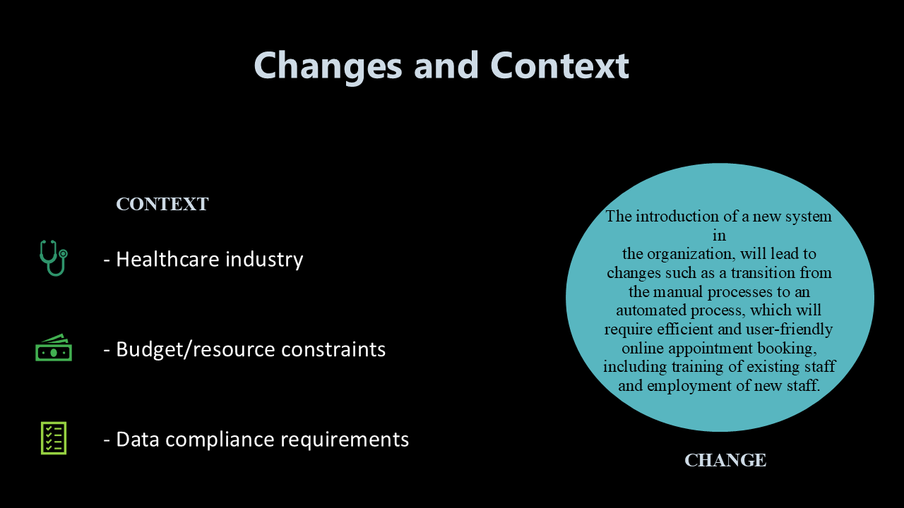

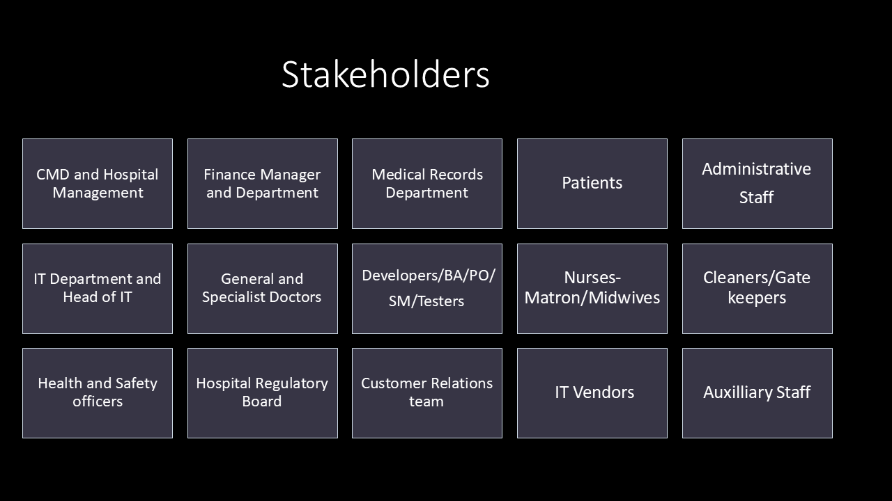

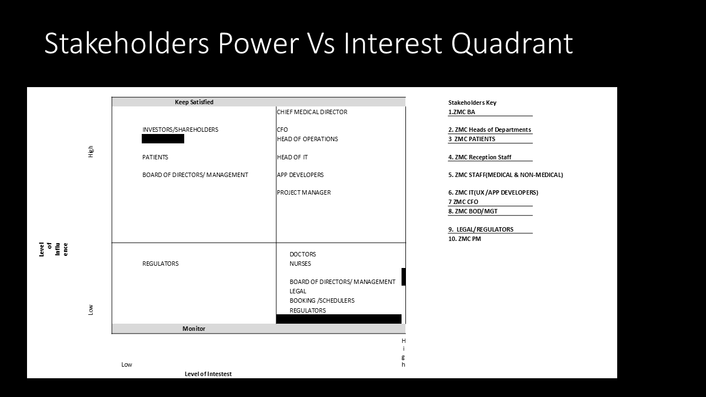

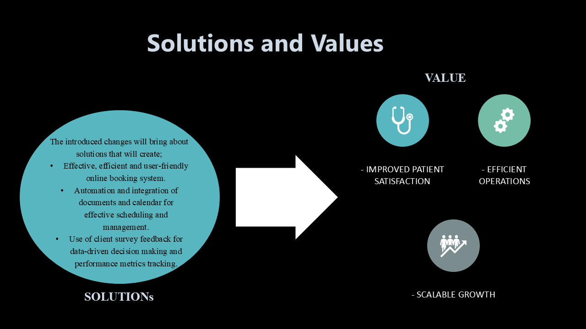

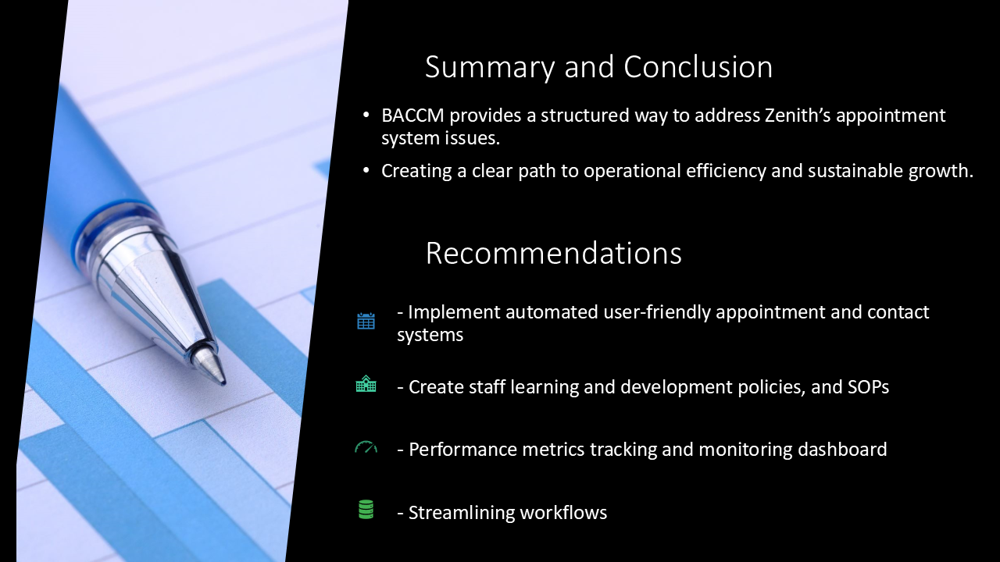

