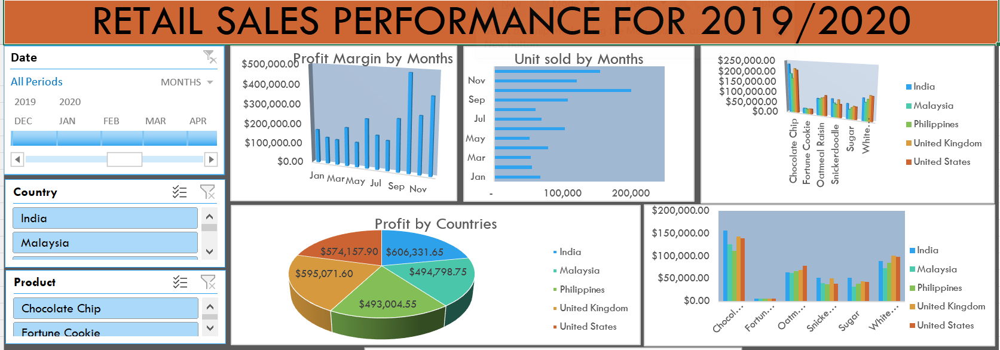

# Babatunde Adegbindin Data Analytics Portfolio
# Project 1

**Title** : [Nike Retail Partners Dashboard 2022](https://github.com/AdeBabs1/dataanalytics)

**Description** : This shows an overview of sales from NIKE Retail partners in 2022. This project provides a comprehensive overview of NIKE's retail partner sales performance in 2022. Using Excel for data cleaning, transformation, and initial analysis, and Power BI for dynamic visualizations and insights, this project highlights key sales trends, revenue distribution, and partner performance. The dashboard includes metrics such as total sales, regional performance breakdowns, top-performing products, and seasonal trends, offering valuable business intelligence for decision-making.

# Project 2

**Title** : [Retail Sales Dashboard for 2019/2020](https://github.com/AdeBabs1/dataanalytics)

**Description** : This is a summary of the retail sales for 2019/2020

# Project 3

**Title** : [Workplace safety power BI Dashboard 2022](https://github.com/AdeBabs1/dataanalytics)

**Description** : This shows a Power BI overview of workplace safety in 2022

# Project 4

**Title** : [INSURANCE POLICY POWER BI DASHBOARD](https://github.com/AdeBabs1/dataanalytics)

**Description** : This shows a Power BI overview of Insurance Policies in 2022

